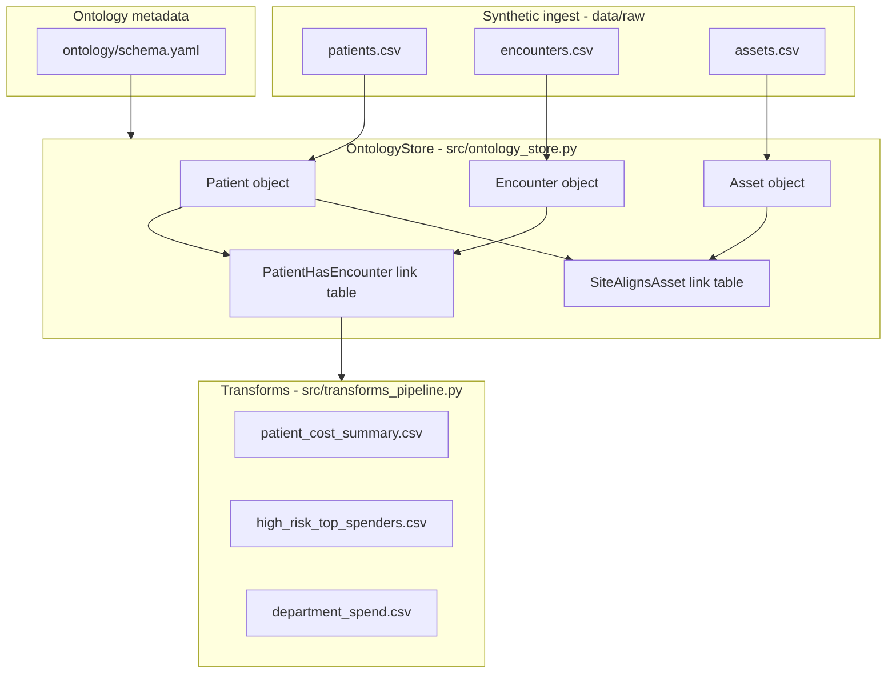
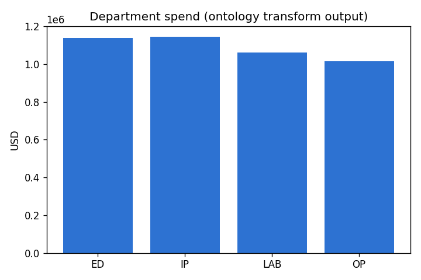

# Palantir Foundry Ontology Simulation (Local)

**Author:** Faiz Elahi · **Type:** EDUCATIONAL LAB · **Data:** 100% synthetic

---

## Educational disclaimer / synthetic data

This repository is a **classroom and portfolio teaching artifact**. It is **not** Palantir Foundry, not a Foundry tenant, and not affiliated with Palantir Technologies. There is no connection to Workshop, Quiver, Ontology SDK, Actions, Functions, or Object Storage V2.

All patients, encounters, assets, and dollar amounts are **generated locally** with fixed random seeds for reproducibility. No real PHI, no employer systems, and no claim of production Foundry administration experience should be inferred from running this lab.

Use honest language in interviews: *“I built a local simulation to practice ontology modeling and transform pipelines.”*

---

## Problem statement (detailed)

Enterprise operations teams rarely think in terms of raw CSV columns. They think in **objects** (Patient, Encounter, Asset), **relationships** (who had which visit, which site owns which equipment), and **derived KPIs** (department spend, high-risk utilizers). Palantir Foundry’s **Ontology** is one popular way to express that semantic layer on top of datasets.

The learning gap for many students is conceptual: they have heard “ontology” but have never **materialized link types** or run **transforms** that consume linked data. This lab closes that gap by:

1. Declaring object types and link types in YAML (a stand-in for Foundry metadata).
2. Loading synthetic healthcare/ops CSVs into an in-memory **OntologyStore**.
3. Running pandas “transforms” that produce operational CSVs under `data/derived/`.

You will practice explaining **why** links exist, **how** transforms depend on them, and **where** a real Foundry deployment would add security, Actions, and live pipelines—without needing a paid tenant.

---

## Why this tool

| Alternative | What you miss without ontology thinking |
|-------------|----------------------------------------|
| Ad hoc SQL on raw tables | Hidden join logic duplicated in every dashboard |
| Single wide denormalized table | Hard to reuse Patient semantics across apps |
| Notebook-only ETL | No shared semantic contract for analysts |

Foundry’s ontology pattern (simulated here) forces you to name **entities**, **keys**, and **relationships** explicitly. Even if your next job uses Snowflake + dbt instead of Foundry, the skill transfers: **conformed entities + documented joins + governed transforms**.

---

## Architecture





Extended notes: [`docs/architecture.md`](docs/architecture.md)

---

## Dataset dictionary (tables / columns)

### Raw layer — `data/raw/` (after `generate_synthetic_data.py`)

| File | Rows (typical) | Column | Type / values | Description |
|------|----------------|--------|---------------|-------------|
| `patients.csv` | 400 | `patient_id` | string `P00001`… | Primary key for Patient object |
| | | `full_name` | string | Synthetic display name |
| | | `risk_tier` | LOW / MEDIUM / HIGH | Utilization risk label (synthetic) |
| | | `primary_site` | North Clinic, South Clinic, Telehealth | Patient’s attributed site |
| `encounters.csv` | ~1,200–1,600 | `encounter_id` | string | Primary key for Encounter object |
| | | `patient_id` | FK → patients | Join key for PatientHasEncounter |
| | | `encounter_date` | ISO date | Service date |
| | | `department` | ED, IP, OP, LAB | Cost center bucket |
| | | `cost_usd` | float | Synthetic line cost |
| `assets.csv` | 50 | `asset_id` | string | Primary key for Asset object |
| | | `asset_type` | MRI, CT, etc. | Equipment category |
| | | `site` | North / South Clinic | Physical site (Telehealth excluded) |
| | | `status` | ACTIVE, MAINTENANCE, RETIRED | Ops status |

### Ontology metadata — `ontology/schema.yaml`

Defines three **object types** (`Patient`, `Encounter`, `Asset`) and two **link types**:

- **PatientHasEncounter** — `Encounter.patient_id` → `Patient.patient_id`
- **SiteAlignsAsset** — `Patient.primary_site` ↔ `Asset.site` (loose teaching link; not production modeling)

### Derived layer — `data/derived/` (after `run_lab.py`)

| File | Columns | Meaning |
|------|---------|---------|
| `patient_cost_summary.csv` | `patient_id`, `risk_tier`, `primary_site`, `encounter_count`, `total_cost_usd` | Per-patient rollup via PatientHasEncounter |
| `high_risk_top_spenders.csv` | Same columns, top 25 HIGH risk by spend | Filter + sort transform |
| `department_spend.csv` | `department`, `total_cost` | Aggregated encounter cost by department |

---

## Prerequisites

- **Python 3.10+** (3.11 recommended on Windows)
- **pip** and ability to create a virtual environment
- Packages: `pandas`, `numpy`, `pyyaml`, `matplotlib` (see `requirements.txt`)
- No Palantir account, no cloud credentials

---

## Step-by-step: how to run

### Windows PowerShell

```powershell
cd palantir-foundry-ontology-sim
python -m venv .venv
.\.venv\Scripts\Activate.ps1
pip install -r requirements.txt
python scripts/generate_synthetic_data.py
python scripts/run_lab.py
python scripts/render_docs_images.py
```

### Optional bash (Linux / macOS / WSL)

```bash
cd palantir-foundry-ontology-sim
python3 -m venv .venv
source .venv/bin/activate
pip install -r requirements.txt
python scripts/generate_synthetic_data.py
python scripts/run_lab.py
python scripts/render_docs_images.py
```

### What success looks like on the console

- Generator prints: `Wrote patients, encounters, assets to data/raw`
- Pipeline prints: `Ontology sim pipeline complete. Object counts: {...}` and `Derived CSVs in .../data/derived`
- Renderer refreshes PNG under `docs/images/`

---

## File-by-file walkthrough

| Path | Role |
|------|------|
| `ontology/schema.yaml` | Declares object types, properties, and link definitions (teaching stand-in for Foundry ontology export) |
| `scripts/generate_synthetic_data.py` | Creates 400 patients, variable encounters, 50 assets with seed `7` |
| `src/ontology_store.py` | Loads CSVs into `objects`, materializes `links` via pandas merges |
| `src/transforms_pipeline.py` | Foundry-style transforms writing three KPI CSVs |
| `scripts/run_lab.py` | Thin entrypoint calling `transforms_pipeline.main()` |
| `scripts/render_docs_images.py` | Builds chart PNGs for README / docs |
| `docs/architecture.md` | Longer architecture narrative |
| `requirements.txt` | Python dependencies |

**Execution order:** generate raw → run lab (schema + store + transforms) → render docs images.

---

## Expected outputs and how to interpret them

1. **`data/raw/*.csv`** — Inspect row counts; encounters should reference valid `patient_id` values.
2. **`data/derived/patient_cost_summary.csv`** — Each row is one patient; `total_cost_usd` is sum of linked encounter costs.
3. **`data/derived/high_risk_top_spenders.csv`** — Subset where `risk_tier == HIGH`; sorted descending by spend (max 25 rows).
4. **`data/derived/department_spend.csv`** — Four departments (ED, IP, OP, LAB); compare bar chart in `docs/images/department_spend.png`.
5. **Console object counts** — Typical ballpark: Patient 400, Encounter 1200+, Asset 50.

---

## Results interpretation

- **Department mix** reflects random assignment in the generator—not real hospital utilization. Use it to explain *how* a transform aggregates, not *which* department is truly most expensive nationally.
- **High-risk top spenders** combine a **patient attribute** (`risk_tier`) with **event costs** (encounters). This mirrors real “segment + utilization” analytics but with synthetic labels.
- **SiteAlignsAsset** inner-joins patients to assets on site; Telehealth patients may not appear in that link table—an intentional teaching moment about **join cardinality** and **incomplete links**.

---

## Glossary (8+ terms)

1. **Ontology** — Semantic layer mapping datasets to real-world entities with typed properties and relationships.
2. **Object type** — Schema for an entity (e.g., Patient) with a primary key and property list.
3. **Link type** — Declared relationship between object types, materialized as a join table in this lab.
4. **Transform** — Derived dataset built from ontology-backed inputs (here: pandas groupbys).
5. **Primary key** — Unique identifier column (`patient_id`, `encounter_id`, `asset_id`).
6. **Materialization** — Computing link or derived tables from source objects (Foundry does this at scale; we do it in memory).
7. **Operational KPI** — Metric consumed by ops leaders (department spend, high-cost cohorts).
8. **Semantic contract** — Shared definition of what “Patient” means across apps and transforms.
9. **Cardinality** — How many related rows exist per key (one patient, many encounters).

---

## Common mistakes (5+)

1. **Claiming Foundry production experience** from this repo alone—recruiters may ask for tenant-specific details you cannot fabricate.
2. **Skipping `generate_synthetic_data.py`** and running transforms on stale or missing CSVs.
3. **Treating SiteAlignsAsset as clinical truth**—it is a loose site-to-asset alignment for teaching.
4. **Forgetting that Encounter IDs are random**—regenerating data changes IDs but preserves structure.
5. **Modeling links without checking null keys**—always validate FK coverage before KPI sign-off in real life.
6. **Confusing YAML schema with Foundry export format**—this file is authored for class, not copied from a tenant.

---

## Exercises (5+)

1. Add a **Provider** object type and `EncounterPerformedBy` link in `schema.yaml`; extend the generator with a `providers.csv`.
2. Export derived tables as **Parquet** partitioned by `primary_site`.
3. Add a transform for **average cost per encounter** by `risk_tier`.
4. Document **cardinality** (1:N, N:M) for each link in `docs/architecture.md`.
5. Wire derived CSVs into **`palantir-aip-analyst-sim`** corpus (or compare answers before/after ontology changes).
6. Add validation: fail the pipeline if any encounter `patient_id` is orphaned.

---

## Limitations / simulation vs production

| This lab | Production Foundry |
|----------|---------------------|
| Local pandas merges | Distributed transforms, scheduling, lineage |
| YAML in git | Ontology managed in platform with ACLs |
| No security markings | Markings, roles, and object-level permissions |
| No Actions / Functions | Write-back and operational workflows |
| CSV + derived CSV | Object Storage V2, virtual tables, API access |

This simulation is **deliberately small** so you can read every line of code in one sitting. That is a feature for learning, not a benchmark for platform scale.

---

## Related labs (sibling folders)

- [`palantir-aip-analyst-sim`](../palantir-aip-analyst-sim/) — Keyword “analyst” Q&A over derived CSV corpus (run this ontology lab first for richest data).
- [`dbt-healthcare-marts-lab`](../dbt-healthcare-marts-lab/) — SQL marts and tests on synthetic healthcare claims.
- [`caboodle-edw-star-schema-lab`](../caboodle-edw-star-schema-lab/) — Star-schema KPIs in DuckDB (warehouse grain vs ontology objects).
- [`databricks-lakehouse-medallion-lab`](../databricks-lakehouse-medallion-lab/) — Bronze/Silver/Gold layering pattern.
- [`hl7-fhir-interop-lab`](../hl7-fhir-interop-lab/) — Clinical message interoperability (complements ops/cost narratives).

---

**License / use:** Educational and synthetic only. **Author:** Faiz Elahi.
