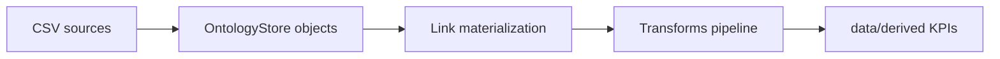

# Architecture — Palantir Foundry Ontology Simulation

**NOT a Foundry tenant.** Local YAML ontology + pandas transforms only.

Objects: Patient, Encounter, Asset. Links: PatientHasEncounter, SiteAlignsAsset.
